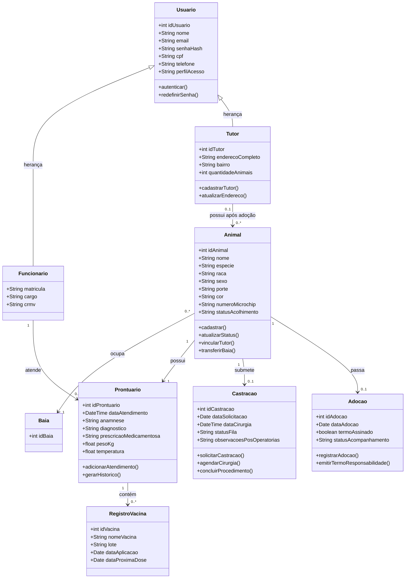

# Architecture

## System Summary

Monorepo pnpm e Turborepo com `apps/web` (Next.js: login, casca do painel, Acessos, perfil, baias e animais) e `apps/api` (NestJS com auth JWT, usuários, baias, animais e `GET /health`). Postgres local está no `compose.yaml`, com migrações Prisma `auth_core`, `gestao_baias` e `gestao_animais`. O domínio de animais tem persistência, API, ocupação real integrada às baias, fotos locais com caminho relativo e telas de lista, cadastro em modal e ficha dedicada.

## Main Modules

- `apps/web`: Next.js com tela de entrar, casca do painel, `/painel/acessos`, `/painel/perfil`, `/painel/baias` e `/painel/animais` com ficha `/painel/animais/[id]`. Cliente HTTP em `src/lib/api.ts` (JWT em memória, refresh via cookie). Menu filtrado por papel em `src/lib/access.ts`.
- `apps/api`: NestJS com módulos `auth`, `users`, `baias`, `animais` e `prisma`. Baias oferece consulta, CRUD coordenado, ações operacionais e histórico. Animais oferece CRUD autenticado, raças, observações, pesagens, eventos simples, timeline, revogação terminal e galeria de fotos local. Escuta em `0.0.0.0` e `PORT` (padrão 3001). `GET /health` não consulta o banco. Seed de coordenação e de raças no boot (`src/seed.ts`).
- `apps/api/prisma`: esquema e migrações de autenticação, baias e persistência de animais.
- `compose.yaml`: Postgres 17 local.
- `tsconfig.base.json` e `eslint.config.mjs`: config compartilhada.

Pacote de contratos ainda não existe.

## Data Flow

O front chama a API com `credentials: "include"`. Login bem-sucedido devolve JWT de acesso (15 minutos, só o id) e grava cookie de refresh HttpOnly (`SameSite=Lax`; `Secure` só em produção; 14 dias com “manter conectado”, senão cookie de sessão). Rotas protegidas leem `perfilAcesso` no banco. Baias permite consulta autenticada e restringe cadastro, edição, ações e histórico à Coordenação. A rota `/painel/baias` usa lista/mapa, filtros compartilhados, formulário lateral, painel de detalhe, ações por estado e histórico. Animais permite que todos os perfis autenticados listem, consultem, criem e editem animais não terminais; adotado/óbito ficam somente leitura, ocultos da lista padrão e podem ser revogados somente pela Coordenação com motivo. Alterações de baia, animal, timeline e fotos e seus eventos de auditoria são gravados na mesma transação da operação de banco. `Animal.baiaId` é opcional; alocação, transferência e retirada passam por `POST /animais/:id/alocacao`, que valida baia ativa, capacidade, exclusividade de isolamento e serializa disputa por vaga travando a baia na transação. Fotos usam upload multipart autenticado, processamento com `sharp`, armazenamento em raiz local gerenciada e entrega por rota autenticada.

## External Integrations

Nenhuma externa. Além do Postgres, a API usa o disco local para mídia gerenciada.

## Storage

Postgres via Prisma. Tabelas deste marco:

- `Usuario` — nome, e-mail, hash da senha, CPF, telefone, `perfilAcesso`, `ativo`.
- `Funcionario` — matrícula, cargo, CRMV; FK para `Usuario`.
- `Solicitacao` — pedido de acesso (`pendente` / `aceita` / `recusada`), função pretendida e hash da senha.
- `RefreshToken` — só o hash do refresh; invalidados na troca de tipo e na troca de senha (exceto o cookie atual).
- `AuditoriaEvento` — tipo, usuário e dados JSON.
- `Baia` — código e código normalizado único, setor, tipo, capacidade, área opcional, solário, exclusividade de isolamento, estado e última higienização. A API retorna ocupantes reais a partir de `Animal.baiaId`, com ocupação e vagas disponíveis. Eventos identificam `entidade: "baia"` e `entidadeId` string em `dados` da auditoria.
- `RacaAnimal` — raça por espécie (`cao`/`gato`), nome normalizado único por espécie, tipo (`catalogo`, `srd`, `outra`, `nao_informada`, `personalizada`) e marca de catálogo padrão.
- `Animal` — identificação, número de registro normalizado único, espécie, raça opcional, sexo/porte/castração com `nao_informado`, situação, `emIsolamento`, peso atual, datas/idade estimada, `baiaId` opcional, autor e acolhedor textual.
- `FotoAnimal`, `PesagemAnimal`, `ObservacaoAnimal`, `EventoAnimal` — galeria, pesagens append-only, observações append-only e timeline/eventos do animal. A migration adiciona índice parcial para uma única foto de identificação por animal.

Arquivos de fotos ficam fora do banco, sob `ZOOTECH_MEDIA_ROOT` ou `MEDIA_ROOT`, resolvidos a partir de `apps/api` (padrão `storage/media`). `FotoAnimal.caminhoAbsoluto` guarda caminho relativo (`animais/{id}/{uuid}.webp`); a leitura/remoção restringe-se à raiz gerenciada. O recorte quadrado acontece no front; a API valida formato/quadrado, comprime para WebP até 1200×1200 e serve pela rota autenticada. O limite de galeria é 10 fotos por animal.

CPF, e-mail e matrícula são únicos entre contas ativas (regra na aplicação). Tutor não entra neste marco. Herança `Usuario` → `Tutor` e o restante do domínio continuam só no diagrama.

## Authentication

- Papéis: `coordenacao`, `veterinario`, `agente`, `recepcao`. Só `coordenacao` lista/aceita/recusa pedidos e troca tipo.
- Conta seed: variáveis `SEED_COORDENACAO_*` e `JWT_SECRET` em `apps/api/.env.example`.
- Front: `zootech.session` guarda só o posto do turno. Recarregar o painel chama `POST /auth/refresh`. Um 401 tenta um único refresh e, se falhar, volta para `/` sem apagar o posto.

## Domain Model

Não existe a classe `Veterinario`: no diagrama, veterinário cabe em `Funcionario` (`cargo`, `crmv`) com `Usuario.perfilAcesso`.

O diagrama original dizia que todo animal tem exatamente um tutor e não tinha `Baia`. Isso foi corrigido em 2026-09-23:

- Animal pode estar sem baia ou ocupar uma baia; pode ser alocado, transferido ou ficar temporariamente sem baia durante tratamento.
- O animal entra sem tutor. O tutor só é vinculado quando o animal é atribuído a uma adoção.
- `Baia` persiste os atributos de cadastro definidos em `.ai-context/specs/gestao-de-baias.md` e seus ocupantes vêm de `Animal.baiaId`.
- API de animais em `apps/api/src/animais/` expõe `GET/POST /animais`, `GET/PATCH /animais/:id`, `GET/POST /animais/racas`, `GET /animais/:id/timeline`, `POST /animais/:id/observacoes`, `POST /animais/:id/pesagens`, `POST /animais/:id/eventos`, `POST /animais/:id/alocacao`, `POST /animais/:id/fotos`, `GET /animais/:id/fotos/:fotoId/arquivo`, `DELETE /animais/:id/fotos/:fotoId` e `POST /animais/:id/revogar-situacao`. Não existe `DELETE /animais/:id`.
- Transferência troca a baia atual. A ação de alocação grava `EventoAnimal` do tipo `mudanca_baia` e `AuditoriaEvento` com origem/destino; não há tabela de histórico própria fora desses eventos.

Relações vigentes:

- `Funcionario` e `Tutor` herdam de `Usuario`.
- Um `Tutor` possui zero ou mais `Animal`. O animal tem zero ou um tutor.
- Um `Animal` ocupa zero ou uma `Baia`. Uma baia abriga zero ou mais animais.
- Um `Animal` possui exatamente um `Prontuario`.
- Um `Prontuario` contém zero ou mais `RegistroVacina`.
- Um `Animal` tem zero ou uma `Castracao`.
- Um `Animal` tem zero ou uma `Adocao`. A adoção é o momento em que o animal recebe o tutor.
- Um `Funcionario` atende zero ou mais `Prontuario`.



## Use Cases

Includes confirmados na imagem de 2026-09-23. Não há outros `include` ou `extend` nesse trecho:

```mermaid
UC06 -.->|"<<include>>"| UC01
UC08 -.->|"<<include>>"| UC01
```

UC06 (prontuário) e UC08 (agendar e executar castração) incluem UC01 (login). Os outros casos de uso se ligam ao login pela associação do ator, sem `include` desenhado.

| Caso de uso | Funcionário do CCZ | Veterinário | ADM |
| --- | --- | --- | --- |
| UC01 Efetuar login | sim | sim | sim |
| UC02 Cadastrar e atualizar tutor | sim | não | sim |
| UC03 Cadastrar e atualizar animal | sim | sim | sim |
| UC04 Registrar acolhimento e triagem | sim | não | sim |
| UC05 Gerenciar fila de castração | sim | não | sim |
| UC06 Registrar atendimento no prontuário | não | sim | sim |
| UC07 Registrar vacinação antirrábica | não | sim | sim |
| UC08 Agendar e executar castração | não | sim | sim |
| UC09 Processar adoção e termo de posse | sim | não | sim |
| UC10 Emitir relatórios epidemiológicos | sim | sim | sim |
| Cadastrar e gerir usuários e funcionários | não | não | sim |
| Consultar registro de auditoria | não | não | sim |

O painel do veterinário ADM reúne todas as funcionalidades do sistema, mais a gestão de usuários e funcionários e o registro de auditoria. A coluna ADM não veio do diagrama de casos de uso; veio da definição do painel.

## Testing Strategy

Jest e supertest em `apps/api` cobrem `GET /health`, as regras de auth (pedido, login, 403, aceite, CRMV, troca de tipo, última coordenação), baias (consulta autenticada, autorização por perfil, duplicidade normalizada de código, capacidade, filtros, transições de estado, higienização, ocupantes reais, bloqueio por ocupação e auditoria) e animais (quatro perfis, 401, CRUD sem DELETE, número duplicado, espécie/raça, criação mínima, lista com terminais ocultos por padrão, observações append-only, pesagens, eventos, timeline, auditoria, revogação terminal, alocação/transferência/saída de baia, capacidade, isolamento, concorrência pela última vaga, upload de fotos, formatos inválidos, fonte acima de 5 MB, crop/compressão, 10ª/11ª foto, colisão concorrente, entrega controlada, remoção/limpeza e path traversal). A persistência inicial de animais foi verificada com `prisma generate`, migration local, typecheck API, seed duplo e checagem temporária de preservação de raça personalizada. O front não tem testes automatizados; fluxos são validados por typecheck, lint, build e verificação manual no navegador.

## Local Development

Node.js 22 ou superior e pnpm 11. `pnpm install` na raiz. `docker compose up -d` (ou Postgres local) e `DATABASE_URL`. Copiar `apps/api/.env.example` para `.env` com `JWT_SECRET` e `SEED_COORDENACAO_*`. `pnpm dev:api` e `pnpm --filter @zootech/web dev` sobem API (3001) e front (3000).

## Deployment

Não definido. Não faz parte do pedido atual.
