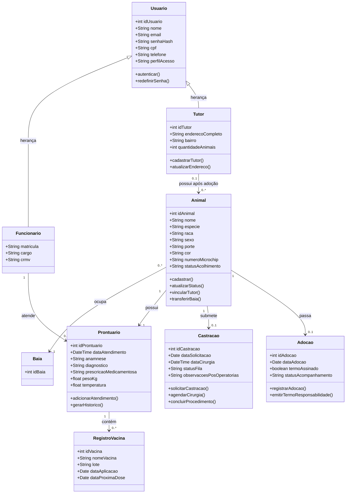

# Architecture

## System Summary

Monorepo pnpm e Turborepo com `apps/web` (Next.js: login, casca do painel, Acessos e perfil) e `apps/api` (NestJS com auth JWT, usuários e `GET /health`). Postgres local está no `compose.yaml`, com migração Prisma `auth_core`. O domínio de animais e baias ainda não tem código.

## Main Modules

- `apps/web`: Next.js com tela de entrar, casca do painel, `/painel/acessos` e `/painel/perfil`. Cliente HTTP em `src/lib/api.ts` (JWT em memória, refresh via cookie). Menu filtrado por papel em `src/lib/access.ts`.
- `apps/api`: NestJS com módulos `auth`, `users` e `prisma`. Escuta em `0.0.0.0` e `PORT` (padrão 3001). `GET /health` não consulta o banco. Seed de coordenação no boot (`src/seed.ts`).
- `apps/api/prisma`: esquema e migração das tabelas de autenticação.
- `compose.yaml`: Postgres 17 local.
- `tsconfig.base.json` e `eslint.config.mjs`: config compartilhada.

Pacote de contratos ainda não existe.

## Data Flow

O front chama a API com `credentials: "include"`. Login bem-sucedido devolve JWT de acesso (15 minutos, só o id) e grava cookie de refresh HttpOnly (`SameSite=Lax`; `Secure` só em produção; 14 dias com “manter conectado”, senão cookie de sessão). Rotas protegidas leem `perfilAcesso` no banco. A coordenação aceita pedidos e troca tipo; o painel esconde seções fora do papel. Eventos mínimos de auditoria ficam em `AuditoriaEvento` (sem tela). Domínio de animal e baia ainda não passa pela API.

## External Integrations

Nenhuma. Só o banco Postgres.

## Storage

Postgres via Prisma. Tabelas deste marco:

- `Usuario` — nome, e-mail, hash da senha, CPF, telefone, `perfilAcesso`, `ativo`.
- `Funcionario` — matrícula, cargo, CRMV; FK para `Usuario`.
- `Solicitacao` — pedido de acesso (`pendente` / `aceita` / `recusada`), função pretendida e hash da senha.
- `RefreshToken` — só o hash do refresh; invalidados na troca de tipo e na troca de senha (exceto o cookie atual).
- `AuditoriaEvento` — tipo, usuário e dados JSON.

CPF, e-mail e matrícula são únicos entre contas ativas (regra na aplicação). Tutor não entra neste marco. Herança `Usuario` → `Tutor` e o restante do domínio continuam só no diagrama.

## Authentication

- Papéis: `coordenacao`, `veterinario`, `agente`, `recepcao`. Só `coordenacao` lista/aceita/recusa pedidos e troca tipo.
- Conta seed: variáveis `SEED_COORDENACAO_*` e `JWT_SECRET` em `apps/api/.env.example`.
- Front: `zootech.session` guarda só o posto do turno. Recarregar o painel chama `POST /auth/refresh`. Um 401 tenta um único refresh e, se falhar, volta para `/` sem apagar o posto.

## Domain Model

Não existe a classe `Veterinario`: no diagrama, veterinário cabe em `Funcionario` (`cargo`, `crmv`) com `Usuario.perfilAcesso`.

O diagrama original dizia que todo animal tem exatamente um tutor e não tinha `Baia`. Isso foi corrigido em 2026-09-23:

- Todo animal ocupa exatamente uma baia e pode ser transferido para outra.
- O animal entra sem tutor. O tutor só é vinculado quando o animal é atribuído a uma adoção.
- Atributos de `Baia` além da identidade ainda não foram definidos.
- Transferência troca a baia atual. Não houve pedido de tabela de histórico própria; o registro de auditoria cobre a mudança. Needs confirmation se o histórico de baias precisa existir fora da auditoria.

Relações vigentes:

- `Funcionario` e `Tutor` herdam de `Usuario`.
- Um `Tutor` possui zero ou mais `Animal`. O animal tem zero ou um tutor.
- Um `Animal` ocupa exatamente uma `Baia`. Uma baia abriga zero ou mais animais.
- Um `Animal` possui exatamente um `Prontuario`.
- Um `Prontuario` contém zero ou mais `RegistroVacina`.
- Um `Animal` tem zero ou uma `Castracao`.
- Um `Animal` tem zero ou uma `Adocao`. A adoção é o momento em que o animal recebe o tutor.
- Um `Funcionario` atende zero ou mais `Prontuario`.



## Use Cases

Includes confirmados na imagem de 2026-09-23. Não há outros `include` ou `extend` nesse trecho:

```mermaid
UC06 -.->|"<<include>>"| UC01
UC08 -.->|"<<include>>"| UC01
```

UC06 (prontuário) e UC08 (agendar e executar castração) incluem UC01 (login). Os outros casos de uso se ligam ao login pela associação do ator, sem `include` desenhado.

| Caso de uso | Funcionário do CCZ | Veterinário | ADM |
| --- | --- | --- | --- |
| UC01 Efetuar login | sim | sim | sim |
| UC02 Cadastrar e atualizar tutor | sim | não | sim |
| UC03 Cadastrar e atualizar animal | sim | sim | sim |
| UC04 Registrar acolhimento e triagem | sim | não | sim |
| UC05 Gerenciar fila de castração | sim | não | sim |
| UC06 Registrar atendimento no prontuário | não | sim | sim |
| UC07 Registrar vacinação antirrábica | não | sim | sim |
| UC08 Agendar e executar castração | não | sim | sim |
| UC09 Processar adoção e termo de posse | sim | não | sim |
| UC10 Emitir relatórios epidemiológicos | sim | sim | sim |
| Cadastrar e gerir usuários e funcionários | não | não | sim |
| Consultar registro de auditoria | não | não | sim |

O painel do veterinário ADM reúne todas as funcionalidades do sistema, mais a gestão de usuários e funcionários e o registro de auditoria. A coluna ADM não veio do diagrama de casos de uso; veio da definição do painel.

## Testing Strategy

Jest e supertest em `apps/api` cobrem `GET /health` e as regras de auth (pedido, login, 403, aceite, CRMV, troca de tipo, última coordenação). O front não tem testes automatizados; o fluxo de login, Acessos e perfil foi exercido no navegador.

## Local Development

Node.js 22 ou superior e pnpm 11. `pnpm install` na raiz. `docker compose up -d` (ou Postgres local) e `DATABASE_URL`. Copiar `apps/api/.env.example` para `.env` com `JWT_SECRET` e `SEED_COORDENACAO_*`. `pnpm dev:api` e `pnpm --filter @zootech/web dev` sobem API (3001) e front (3000).

## Deployment

Não definido. Não faz parte do pedido atual.
