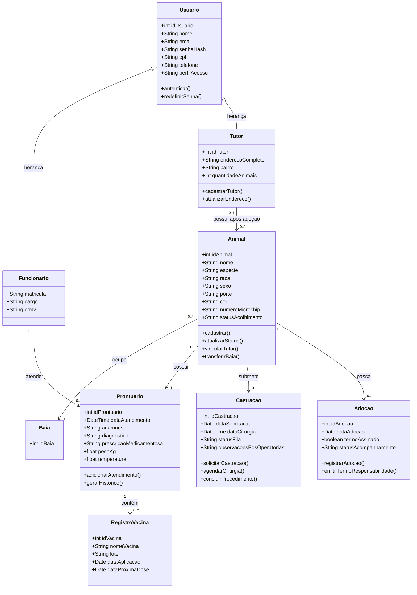

# Architecture

## System Summary

Monorepo pnpm e Turborepo com `apps/web` (Next.js: login, casca do painel, Acessos, perfil, baias, animais, castrações, vacinação e dashboard) e `apps/api` (NestJS com auth JWT, usuários, baias, animais, castrações, vacinação, tutores, adoções, dashboard e `GET /health`). Postgres local está no `compose.yaml`, com migrações Prisma de autenticação, baias, animais, fotos, castrações, adoção e vacinação. O domínio de animais tem persistência, API, ocupação real integrada às baias, fotos locais com caminho relativo e telas de lista, cadastro em modal e ficha dedicada.

## Main Modules

- `apps/web`: Next.js com tela de entrar, casca do painel, `/painel/acessos`, `/painel/perfil`, `/painel/baias`, `/painel/animais` com ficha `/painel/animais/[id]`, `/painel/castracoes` e `/painel/vacinacao` (agenda) com `/painel/vacinacao/vacinas` (catálogo). Cliente HTTP em `src/lib/api.ts` (JWT em memória, refresh via cookie). Menu filtrado por papel em `src/lib/access.ts`.
- `apps/api`: NestJS com módulos `auth`, `users`, `baias`, `animais`, `vacinacao`, `tutores`, `adocoes`, `dashboard` e `prisma`. Baias oferece consulta, CRUD coordenado, ações operacionais e histórico. Animais oferece CRUD autenticado, raças, observações, pesagens, eventos simples, timeline, revogação terminal, galeria de fotos local e operações de castração. Vacinação oferece catálogo, protocolos, aplicações e agenda. Dashboard oferece `GET /dashboard`, leitura agregada autenticada comum a todos os perfis. Escuta em `0.0.0.0` e `PORT` (padrão 3001). `GET /health` não consulta o banco. Seed de coordenação e de raças no boot (`src/seed.ts`).
- `apps/api/prisma`: esquema e migrações de autenticação, baias, animais, fotos, castrações, adoção e vacinação.
- `compose.yaml`: Postgres 17 local.
- `tsconfig.base.json` e `eslint.config.mjs`: config compartilhada.

Pacote de contratos ainda não existe.

## Data Flow

O front chama a API com `credentials: "include"`. Login bem-sucedido devolve JWT de acesso (15 minutos, só o id) e grava cookie de refresh HttpOnly (`SameSite=Lax`; `Secure` só em produção; 14 dias com “manter conectado”, senão cookie de sessão). Rotas protegidas leem `perfilAcesso` no banco. Baias permite consulta autenticada e restringe cadastro, edição, ações e histórico à Coordenação. A rota `/painel/baias` usa lista/mapa, filtros compartilhados, formulário lateral, painel de detalhe, ações por estado e histórico. Animais permite que todos os perfis autenticados listem, consultem, criem e editem animais não terminais; adotado/óbito ficam somente leitura, ocultos da lista padrão e podem ser revogados somente pela Coordenação com motivo. Alterações de baia, animal, timeline e fotos e seus eventos de auditoria são gravados na mesma transação da operação de banco. `Animal.baiaId` é opcional; alocação, transferência e retirada passam por `POST /animais/:id/alocacao`, que valida baia ativa, capacidade, exclusividade de isolamento e serializa disputa por vaga travando a baia na transação. Fotos usam upload multipart autenticado, processamento com `sharp`, armazenamento em raiz local gerenciada e entrega por rota autenticada.

## External Integrations

Nenhuma externa. Além do Postgres, a API usa o disco local para mídia gerenciada.

## Storage

Postgres via Prisma. Tabelas deste marco:

- `Usuario` — nome, e-mail, hash da senha, CPF, telefone, `perfilAcesso`, `ativo`.
- `Funcionario` — matrícula, cargo, CRMV; FK para `Usuario`.
- `Solicitacao` — pedido de acesso (`pendente` / `aceita` / `recusada`), função pretendida e hash da senha.
- `RefreshToken` — só o hash do refresh; invalidados na troca de tipo e na troca de senha (exceto o cookie atual).
- `AuditoriaEvento` — tipo, usuário e dados JSON.
- `Baia` — código e código normalizado único, setor, tipo, capacidade, área opcional, solário, exclusividade de isolamento, estado e última higienização. A API retorna ocupantes reais a partir de `Animal.baiaId`, com ocupação e vagas disponíveis. Cada ocupante inclui registro, raça, sexo, situação, castração, alertas e fotos para a visualização no detalhe da baia, com link para a ficha do animal. O histórico da baia combina sua auditoria própria com eventos auditados de alocação, transferência, retirada, adoção e devolução, enriquecidos com identidade atual do animal e código da outra baia. Eventos próprios identificam `entidade: "baia"` e `entidadeId` string em `dados` da auditoria.
- `RacaAnimal` — raça por espécie (`cao`/`gato`), nome normalizado único por espécie, tipo (`catalogo`, `srd`, `outra`, `nao_informada`, `personalizada`) e marca de catálogo padrão.
- `Animal` — identificação, número de registro normalizado único, espécie, raça opcional, sexo/porte, situação, `emIsolamento`, peso atual, datas/idade estimada, `baiaId` opcional, autor e acolhedor textual. O campo legado `castrado` foi removido do schema; status de castração passa a ser derivado de `CastracaoAnimal`.
- `CastracaoAnimal` — avaliação ou procedimento vinculado ao animal, com estado (`nao_castrado`, `agendada`, `realizada`, `cancelada`), origem (`fluxo` ou `legada`), data/hora planejada, data efetiva com indicador de hora conhecida, data de avaliação, observação, motivo de cancelamento e autor. Índices parciais no SQL garantem no máximo um agendamento ativo e no máximo um procedimento realizado por animal. A migration `20260925120000_gestao_castracoes_modelo` converte `castrado = sim` para procedimento legado realizado sem data, `castrado = nao` para avaliação legada “Não castrado” e `nao_informado` para ausência de registro.
- `/painel` hospeda `DashboardContent`, cliente que consulta `obterDashboard` pelo mecanismo autenticado de `api.ts` após o Shell restaurar a sessão. Exibe plantel, clínica, pendências, ocupação e adoções; skeleton, erro com nova tentativa e zeros são estados distintos. Atualização manual refaz a consulta. Indicadores com destino compatível apontam para a lista de animais por situação/período/baia, a agenda de castrações e o detalhe da baia; o fim exclusivo mensal da API é convertido no limite inclusivo `adotadaAte` da lista.
- `GET /dashboard` agrega diretamente `Animal`, `Baia`, `CastracaoAnimal` e `Adocao`, sem carregar listas no cliente. A resposta separa ativos de alojados em baias ativas, lista baias ativas e expõe ocupações irregulares por causa. Vacinação é roadmap, sem contagem numérica.
- `GET /animais/castracoes` oferece consulta paginada dos procedimentos, com estado, período e busca por nome ou registro. A página `/painel/castracoes` consome essa consulta e executa as transições nas rotas por animal. A API de animais retorna `estadoCastracao` derivado dos registros em lista e detalhe; a ficha apresenta histórico e ações de castração sem editar o status pelo formulário de animal.
- `FotoAnimal`, `PesagemAnimal`, `ObservacaoAnimal`, `EventoAnimal` — galeria, pesagens append-only, observações append-only e timeline/eventos do animal. Castrações gravam eventos do tipo `castracao` junto da auditoria na mesma transação. A migration adiciona índice parcial para uma única foto de identificação por animal.

Arquivos de fotos ficam fora do banco, sob `ZOOTECH_MEDIA_ROOT` ou `MEDIA_ROOT`, resolvidos a partir de `apps/api` (padrão `storage/media`). `FotoAnimal.caminhoAbsoluto` guarda caminho relativo (`animais/{id}/{uuid}.webp`); a leitura/remoção restringe-se à raiz gerenciada. O recorte quadrado acontece no front; a API valida formato/quadrado, comprime para WebP até 1200×1200 e serve pela rota autenticada. O limite de galeria é 10 fotos por animal.

CPF, e-mail e matrícula são únicos entre contas ativas (regra na aplicação). Tutor não entra neste marco. Herança `Usuario` → `Tutor` e o restante do domínio continuam só no diagrama.

## Authentication

- Papéis: `coordenacao`, `veterinario`, `agente`, `recepcao`. Só `coordenacao` lista/aceita/recusa pedidos e troca tipo.
- Conta seed: variáveis `SEED_COORDENACAO_*` e `JWT_SECRET` em `apps/api/.env.example`.
- Front: `zootech.session` guarda só o posto do turno. Recarregar o painel chama `POST /auth/refresh`. Um 401 tenta um único refresh e, se falhar, volta para `/` sem apagar o posto.

## Domain Model

Não existe a classe `Veterinario`: no diagrama, veterinário cabe em `Funcionario` (`cargo`, `crmv`) com `Usuario.perfilAcesso`.

O diagrama original dizia que todo animal tem exatamente um tutor e não tinha `Baia`. Isso foi corrigido em 2026-09-23:

- Animal pode estar sem baia ou ocupar uma baia; pode ser alocado, transferido ou ficar temporariamente sem baia durante tratamento.
- O animal entra sem tutor. O tutor só é vinculado quando o animal é atribuído a uma adoção.
- `Baia` persiste os atributos de cadastro definidos em `.ai-context/specs/gestao-de-baias.md` e seus ocupantes vêm de `Animal.baiaId`.
- API de animais em `apps/api/src/animais/` expõe `GET/POST /animais`, `GET/PATCH /animais/:id`, `GET/POST /animais/racas`, `GET /animais/:id/timeline`, `POST /animais/:id/observacoes`, `POST /animais/:id/pesagens`, `POST /animais/:id/eventos`, `POST /animais/:id/alocacao`, `POST /animais/:id/fotos`, `GET /animais/:id/fotos/:fotoId/arquivo`, `DELETE /animais/:id/fotos/:fotoId` e `POST /animais/:id/revogar-situacao`. Não existe `DELETE /animais/:id`.
- Transferência troca a baia atual. A ação de alocação grava `EventoAnimal` do tipo `mudanca_baia` e `AuditoriaEvento` com origem/destino; não há tabela de histórico própria fora desses eventos.

Relações vigentes:

- `Funcionario` e `Tutor` herdam de `Usuario`.
- Um `Tutor` possui zero ou mais `Animal`. O animal tem zero ou um tutor.
- Um `Animal` ocupa zero ou uma `Baia`. Uma baia abriga zero ou mais animais.
- Um `Animal` possui exatamente um `Prontuario`.
- Um `Prontuario` contém zero ou mais `RegistroVacina`.
- Um `Animal` tem zero ou mais registros em `CastracaoAnimal`, preservando tentativas canceladas; por restrição, há no máximo um agendamento ativo e um procedimento realizado.
- Um `Animal` tem zero ou mais adoções ao longo do tempo, mas no máximo uma ativa. A adoção vincula tutor e torna a situação `adotado`; a devolução encerra o vínculo de guarda atual, preserva o registro anterior e permite outra adoção. Este é o modelo de produto especificado para implementação; o diagrama legado abaixo ainda mostra a cardinalidade antiga `0..1`.
- Um `Funcionario` atende zero ou mais `Prontuario`.

```mermaid
classDiagram
    direction TB

    class Usuario {
        +int idUsuario
        +String nome
        +String email
        +String senhaHash
        +String cpf
        +String telefone
        +String perfilAcesso
        +autenticar()
        +redefinirSenha()
    }

    class Funcionario {
        +String matricula
        +String cargo
        +String crmv
    }

    class Tutor {
        +int idTutor
        +String enderecoCompleto
        +String bairro
        +int quantidadeAnimais
        +cadastrarTutor()
        +atualizarEndereco()
    }

    class Animal {
        +int idAnimal
        +String nome
        +String especie
        +String raca
        +String sexo
        +String porte
        +String cor
        +String numeroMicrochip
        +String statusAcolhimento
        +cadastrar()
        +atualizarStatus()
        +vincularTutor()
        +transferirBaia()
    }

    class Baia {
        +int idBaia
    }

    class Prontuario {
        +int idProntuario
        +DateTime dataAtendimento
        +String anamnese
        +String diagnostico
        +String prescricaoMedicamentosa
        +float pesoKg
        +float temperatura
        +adicionarAtendimento()
        +gerarHistorico()
    }

    class RegistroVacina {
        +int idVacina
        +String nomeVacina
        +String lote
        +Date dataAplicacao
        +Date dataProximaDose
    }

    class Castracao {
        +int idCastracao
        +Date dataSolicitacao
        +DateTime dataCirurgia
        +String statusFila
        +String observacoesPosOperatorias
        +solicitarCastracao()
        +agendarCirurgia()
        +concluirProcedimento()
    }

    class Adocao {
        +int idAdocao
        +Date dataAdocao
        +boolean termoAssinado
        +String statusAcompanhamento
        +registrarAdocao()
        +emitirTermoResponsabilidade()
    }

    Usuario <|-- Funcionario : herança
    Usuario <|-- Tutor : herança
    Tutor "0..1" --> "0..*" Animal : possui após adoção
    Animal "0..*" --> "1" Baia : ocupa
    Animal "1" --> "1" Prontuario : possui
    Prontuario "1" --> "0..*" RegistroVacina : contém
    Animal "1" --> "0..1" Castracao : submete
    Animal "1" --> "0..1" Adocao : passa
    Funcionario "1" --> "0..*" Prontuario : atende
```

### Vacinação (implementada em 2026-09-25/26)

Spec, plano e tarefas em `.ai-context/specs|plans|tasks/gestao-de-vacinacao.md`. Decisões em `decisions.md` (duas de 2026-09-25). O diagrama original põe `RegistroVacina` dentro de `Prontuario`; como o prontuário não existe no código, a aplicação liga direto ao `Animal` e `AplicacaoVacina.prontuarioId` fica nulo e reservado.

**Modelos** (`apps/api/prisma/schema.prisma`, migrations `20260925210000` a `20260925230000`):

- `Vacina`: catálogo com espécies, `totalDoses`, intervalo, revacinação, `diasAvisoProximaDose` (padrão 7, 0 desliga o aviso), idade mínima, `obrigatoria`, `ativa`. Nunca excluída. Seed idempotente só com a antirrábica (`seedVacinas`).
- `ProtocoloVacinal`: par animal+vacina, único. Guarda a fotografia do esquema na criação, para as doses faltantes não mudarem quando o catálogo muda. Doses aplicadas, faltantes, próxima dose e data mínima são **derivadas** das aplicações não anuladas; só `status` é persistido (`interrompido` não é derivável).
- `AplicacaoVacina`: dose aplicada. Datas civis em `@db.Date`. Nunca excluída nem editada em campo estrutural; correção é anulação motivada (`anuladaEm`). Marcações imutáveis: `aplicadaAdiantada` (com motivo e dias), `registroRetroativo`.
- `AgendamentoVacinacao`: estados `agendado`, `aplicado`, `faltou`, `cancelado`. `atrasado` é derivado, não armazenado. O vínculo com a aplicação é só `aplicacaoId` (único); a aplicação lê o inverso.
- `Animal.observacaoAntirrabicaInicioEm` e a situação `em_observacao_antirrabica` (período fixo de 10 dias corridos no código).
- `EventoAnimal` ganhou `aplicacaoVacinaId`, `eventoOrigemId` (auto-relação), `gravidadeReacao` e `desfechoReacao`, mais 12 tipos de evento. Os enums `GravidadeReacaoAdversa` e `DesfechoReacaoAdversa` têm valores **propostos, sem aval clínico**.

**Integridade no banco** (SQL escrito à mão na migration, porque Prisma não declara): dois índices únicos parciais (`aplicacoes_vacinas_dose_ativa_unica_idx` em `(protocoloId, numeroDose) WHERE anuladaEm IS NULL` e `agendamentos_vacinacao_aberto_unico_idx` em `(animalId, vacinaId) WHERE status = 'agendado'`) e 17 `CHECK`s. Regerar a migration com `migrate dev` perde os índices; os testes de concorrência denunciam.

**API** (`apps/api/src/vacinacao/`, três services: `VacinasService`, `VacinacaoService`, `AgendaService`; `protocolo.ts` com o cálculo de próxima dose compartilhado com os alertas; `eventos.ts` com evento e auditoria compartilhados; `datas.ts` com datas civis):

- `GET/POST/PATCH /vacinas`, `POST /vacinas/:id/inativar|reativar` (escrita só Coordenação; sem `DELETE`).
- `GET /animais/:id/vacinacao`; `POST/PATCH /animais/:id/vacinacao/aplicacoes`; `POST .../aplicacoes/:id/anular` (só Coordenação); `POST .../protocolos/:id/interromper|retomar`; `GET /vacinacao/aplicacoes?lote=` (com reação adversa por aplicação).
- `GET /vacinacao/agenda`, `GET|POST|PATCH /vacinacao/agendamentos`, `POST .../:id/cancelar|falta|baixa`. A baixa cria a aplicação e fecha o agendamento na mesma transação (`VacinacaoService.aplicarNaTransacao`).
- `POST /animais/:id/encerrar-observacao-antirrabica` e reação adversa via `POST /animais/:id/eventos` com `tipo: "reacao_adversa"`, no módulo `animais`.
- Toda recusa de regra de domínio é 409 com `codigo` estável. Consulta é livre para os quatro perfis; escrita é clínica (`coordenacao`, `veterinario`), exceto reação adversa e situação, que seguem a regra de eventos de animais.
- Nove alertas entram em `alertas()` de `animais.service.ts` e no contador da listagem. `protocolosVacinais` e `eventos` são carregados só para calculá-los e não vão na resposta. Custo medido da listagem paginada: 9 ms para 20 ms por página de 20, por página e não pelo total.
- "Hoje" é aferido em `America/Sao_Paulo` (`ZOOTECH_TIMEZONE`). Datas do animal (acolhimento, nascimento) são lidas como civis em UTC, porque o front as envia de `<input type="date">`.

**Front** (`apps/web`): contrato em `src/lib/api.ts` (`ApiError` carrega `codigo` e `dados`); helpers `canViewVacinacao`, `canManageVacinacao`, `canManageCatalogoVacinas`, `canAnularAplicacaoVacina`, `canRegistrarReacaoAdversa` em `src/lib/access.ts`; `sectionRoles.vacinacao` passou de `clinico` para `todos`. Telas: `/painel/vacinacao` (agenda), `/painel/vacinacao/vacinas` (catálogo) e a seção `#vacinacao-ficha` na ficha do animal, com componentes em `src/components/vacinacao/`. O aviso de dose adiantada é calculado no cliente a partir de `dataMinimaProximaDose`, e a API o exige de novo (409 sem confirmação e motivo).

## Use Cases

Includes confirmados na imagem de 2026-09-23. Não há outros `include` ou `extend` nesse trecho:

```mermaid
UC06 -.->|"<<include>>"| UC01
UC08 -.->|"<<include>>"| UC01
```

UC06 (prontuário) e UC08 (agendar e executar castração) incluem UC01 (login). Os outros casos de uso se ligam ao login pela associação do ator, sem `include` desenhado.

| Caso de uso | Funcionário do CCZ | Veterinário | ADM |
| --- | --- | --- | --- |
| UC01 Efetuar login | sim | sim | sim |
| UC02 Cadastrar e atualizar tutor | sim | não | sim |
| UC03 Cadastrar e atualizar animal | sim | sim | sim |
| UC04 Registrar acolhimento e triagem | sim | não | sim |
| UC05 Gerenciar fila de castração | sim | não | sim |
| UC06 Registrar atendimento no prontuário | não | sim | sim |
| UC07 Registrar vacinação antirrábica | não | sim | sim |
| UC08 Agendar e executar castração | não | sim | sim |
| UC09 Processar adoção e termo de posse | sim | não | sim |
| UC10 Emitir relatórios epidemiológicos | sim | sim | sim |
| Cadastrar e gerir usuários e funcionários | não | não | sim |
| Consultar registro de auditoria | não | não | sim |

O painel do veterinário ADM reúne todas as funcionalidades do sistema, mais a gestão de usuários e funcionários e o registro de auditoria. A coluna ADM não veio do diagrama de casos de uso; veio da definição do painel.

## Testing Strategy

Jest e supertest em `apps/api` cobrem `GET /health`, as regras de auth (pedido, login, 403, aceite, CRMV, troca de tipo, última coordenação), baias (consulta autenticada, autorização por perfil, duplicidade normalizada de código, capacidade, filtros, transições de estado, higienização, ocupantes reais, bloqueio por ocupação e auditoria) e animais (quatro perfis, 401, CRUD sem DELETE, número duplicado, espécie/raça, criação mínima, lista com terminais ocultos por padrão, observações append-only, pesagens, eventos, timeline, auditoria, revogação terminal, alocação/transferência/saída de baia, capacidade, isolamento, concorrência pela última vaga, upload de fotos, formatos inválidos, fonte acima de 5 MB, crop/compressão, 10ª/11ª foto, colisão concorrente, entrega controlada, remoção/limpeza e path traversal). Castrações têm cobertura para consulta global, 401, acesso dos quatro perfis, autoria, avaliação, agendamento, reagendamento, conclusão, cancelamento, nova tentativa após cancelamento, bloqueio de agendamento/procedimento duplicado, animal terminal, estado derivado e rollback quando auditoria falha. A persistência inicial de animais foi verificada com `prisma generate`, migration local, typecheck API, seed duplo e checagem temporária de preservação de raça personalizada. As migrations de castração foram aplicadas no Postgres local e a suíte da API valida os fluxos principais. O front não tem testes automatizados; fluxos são validados por typecheck, lint, build e verificação manual no navegador.

## Local Development

Node.js 22 ou superior e pnpm 11. `pnpm install` na raiz. `docker compose up -d` (ou Postgres local) e `DATABASE_URL`. Copiar `apps/api/.env.example` para `.env` com `JWT_SECRET` e `SEED_COORDENACAO_*`. `pnpm dev:api` e `pnpm --filter @zootech/web dev` sobem API (3001) e front (3000).

## Deployment

Não definido. Não faz parte do pedido atual.
